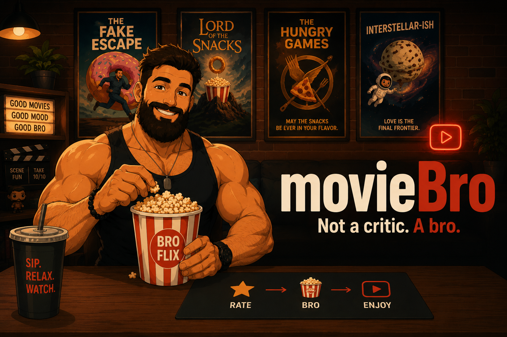

# movieBro 🎬🍿

**Your movie bro.** Rate a few movies, and he learns your taste — then serves
your next watch, one pick per favorite genre, plus a search bar that
understands *"mind-bending sci-fi like Inception but sadder."*

> Not a critic. A bro. He doesn't judge your taste — he feeds it.

## What it does

1. **Onboarding** — a wall of posters; ❤️ the ones you loved, 🥔 the duds,
   skip the ones you haven't seen. Ten reactions unlock the dashboard — rate
   more and he gets sharper. That's the only input.
2. **"Your next watch" dashboard** — your top 3 genres inferred from your
   ratings, one **collaborative-filtering** pick per genre: movies loved by
   people who rated like you, not just popular stuff.
3. **The search bar** — free-text, vibe-friendly. Hybrid retrieval (semantic +
   keyword) over plot, tags, and keywords → a **3×3 grid of matched movies**,
   reranked by a cross-encoder. Hover a poster to see *why* it matched.
4. **Blend mode** — flip a slider and the search results tilt toward *your*
   taste: same query, personalized order. Search that knows your bro.
5. **Honest evaluation** — held-out ratings, hit-rate@10 / NDCG vs a
   popularity baseline, published in EVALUATION.md. If the fancy stuff doesn't
   beat "just recommend popular movies," the table will say so.

## How it works (in your browser — no accounts, no tracking)

- **Recommendations:** item-item collaborative filtering trained offline on
  **MovieLens** ratings; each movie ships with its top-neighbor list, and your
  ❤️/🥔 reactions are folded in client-side (score = Σ similarity ×
  (your rating − your average)). Your ratings never leave your device.
- **Search:** movies are *parents*; plot sentences, crowd tags and keywords
  are *children*. Your query is embedded in-browser (transformers.js); the
  **dense** nearest-neighbor lookup runs on a managed vector DB (**Pinecone**),
  reached through a thin **Cloudflare Worker** that keeps the API key
  server-side. Everything else stays client-side: **BM25** (in JS) →
  **Reciprocal Rank Fusion** → best-hit grouping to the parent movie →
  **cross-encoder rerank** of the finalists (in-browser, ONNX). The Worker is
  a pure proxy — no app logic, no database of yours, no user data.
- **Serving:** the catalog, neighbor lists and search index are precomputed
  into static files at build time and hosted on GitHub Pages; the only moving
  part is the thin Worker in front of Pinecone. Both run on free tiers —
  recurring cost: €0.

## Try it

**→ [captainjimbo.github.io/movieBro](https://captainjimbo.github.io/movieBro/)**

Rate 10 posters, get your picks, then search for *"mind-bending sci-fi
like Inception"* and drag the **blend** slider. Honest numbers behind it
all: [EVALUATION.md](EVALUATION.md) — including the three times the
evaluation falsified this very spec.

## Data & credits

- **[MovieLens](https://grouplens.org/datasets/movielens/)** (GroupLens
  Research) — ratings and tags. Used under their non-commercial
  research license, with citation: F. M. Harper & J. A. Konstan, *The
  MovieLens Datasets: History and Context*, ACM TiiS 5(4), 2015.
- **[TMDB](https://www.themoviedb.org/)** — posters, overviews, keywords via
  their free API. *This product uses the TMDB API but is not endorsed or
  certified by TMDB.*

## License

MIT © 2026 Dimitris Kogias (code; datasets keep their own licenses)

---

*Built by [Dimitris Kogias](https://captainjimbo.github.io) — physicist &
AI/ML systems engineer. Siblings:
[Ο Ήλιος](https://github.com/CaptainJimbo/o-ilios) ·
[ArcheoLogic](https://github.com/CaptainJimbo/archeologic) ·
[pyroPythia](https://github.com/CaptainJimbo/pyroPythia) ·
[LimenarchisAI](https://github.com/CaptainJimbo/limenarchisAI).*
